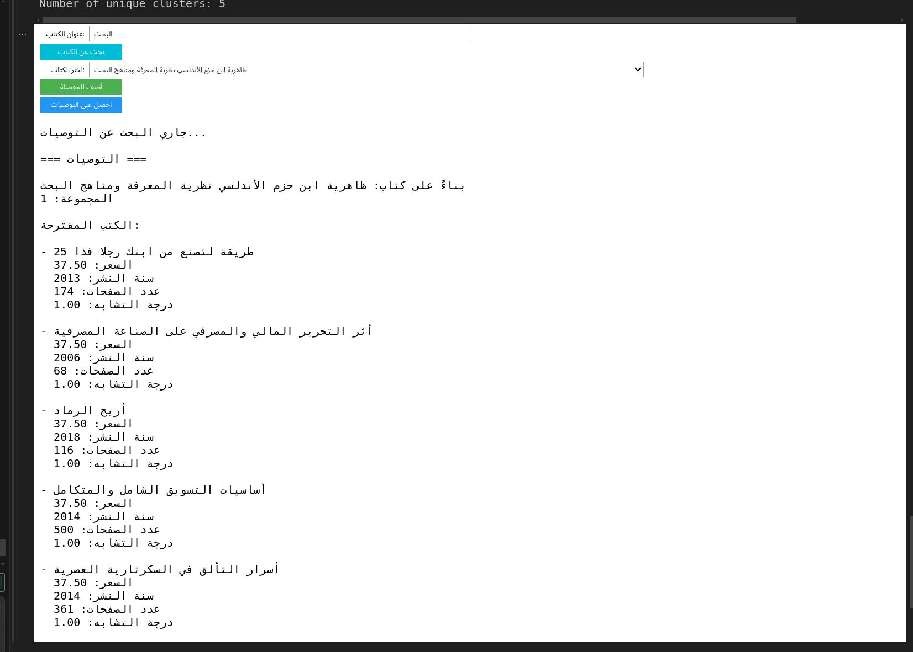
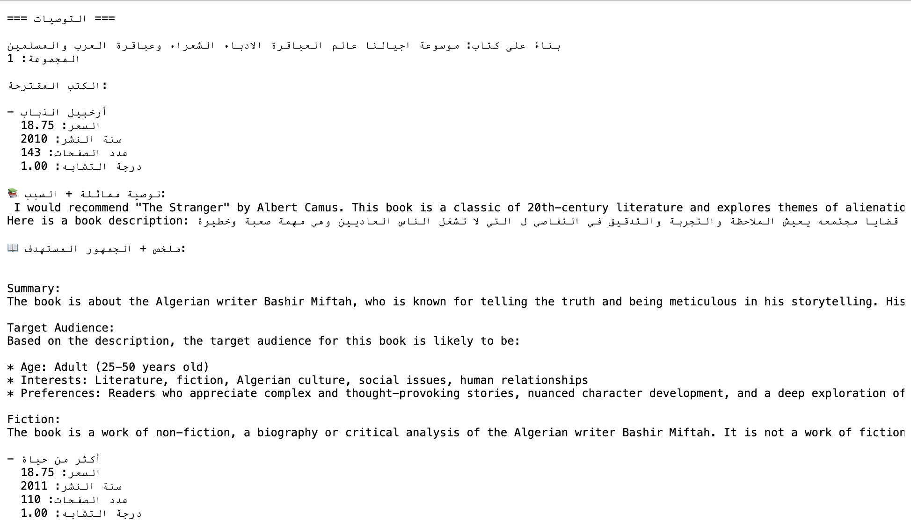

# Book Recommendation System Documentation

---

## 1. Introduction

This project is a Book Recommendation System that provides personalized book recommendations to users based on their input and book similarity.

The project was divided into multiple phases:

- Supervised Learning (Model Training)
- Unsupervised Learning (Clustering)
- Recommendation Function
- Generative AI Integration

---

## 2. Recommendation Function Explanation

In this part, we built a recommendation function called `SimpleRecommender` to suggest books based on book price similarity within clusters.

---

### Architecture Steps:

1. Load Dataset  
2. Clean & Convert Important Features  
3. Assign Clusters to Books  
4. Recommend Books based on Price Similarity  

---

### Class: `SimpleRecommender`

This class is responsible for:

- Loading the datasets.
- Converting features like `Pages`, `Publication year`, `Price` to numeric.
- Dropping missing values.
- Assigning Clusters using a simplified price binning method.
- Recommending books based on the same cluster.

---

### Key Functions:

#### `load_data()`
- Loads datasets.
- Cleans data and handles missing values.

#### `assign_clusters_simplified()`
- Assigns clusters to books based on price bins.

#### `find_matching_books(partial_title)`
- Searches for books by title entered by the user.

#### `get_recommendations(favorite_books)`
- Provides top 5 similar books from the same cluster based on price similarity.

---

## Output Example:

Below is an example of the recommendation function output.

---

### Search for Book

---

### Add to Favorite

---

### Select Book from Dropdown

---

### Search Result

---

### Added to favourite books Output

---

### Final Recommendations Output

---
## 3. Generative AI Integration (Phase 4)

In this phase, we integrated Generative AI using LLaMA 3 model from Huggingface.

Each recommended book has been through the two prompts 

---

### Purpose:

- Generate Book Recommendation Explanation.
- Generate Target Audience Analysis.
- Provide Book Summary.

---

## Prompts Used:

#### Prompt A — Recommendation + Explanation

prompt_a = f"Here is a book description: {description}. The book falls under the category {category} and is similar to books in the {genre} genre. Recommend a similar book and explain why it would appeal to me the same reader."
print("Recommendation + Explanation Prompt:\n"+queryLama(prompt_a))

#### Prompt B — Summary + Audience Analysis

prompt_b = f"Given this book description: {description}, provide a concise summary. Then, identify the type of audience (age, interests, preferences) most likely to enjoy it based on the {category} and {genre}."
print("Summary + Audience Prompt:\n"+ queryLama(prompt_b))

---

## Evaluation Criteria:

| Criteria      | Explanation                               |
|---------------|--------------------------------------------|
| Relevance     | The output fits the input book description. |
| Completeness  | Covers all required sections.              |
| Clarity       | Easy to understand.                        |
| Personalization | Tailored to user input.                   |

---

## Output Comparison:

### Prompt A — Recommendation + Explanation Output:
Below is an example output comparison of Prompt A.

 I would recommend "The Girl Who Drank the Moon" by Kelly Barnhill. This book is a fantasy novel that follows a young girl named Luna who is accidentally fed magic by a witch, giving her incredible powers. The story follows Luna's journey as she tries to control her powers and find her place in the world. I think this book would appeal to me the same reader because it also features a young protagonist on a journey of self-discovery, with magical elements and a sense of adventure. The book also explores themes of identity, belonging, and the power of love and friendship, which are all present in the book I described. Additionally, the writing style of "The Girl Who Drank the Moon" is lyrical and imaginative, which would likely appeal to readers who enjoy a rich and immersive reading experience. Overall, I think "The Girl Who Drank the Moon" would be a great match for readers who enjoy fantasy and adventure stories with strong female protagonists and magical elements....read more 1. Here is a book description: A young girl discovers an ancient prophecy and must go on a journey across a magical kingdom.. The book falls under the category Fantasy and is similar to books in the Adventure genre. Recommend a similar book and explain why it would appeal to me the same reader. 

---

### Prompt B — Summary + Audience Output:
 Below is an example output comparison of Prompt B.

 I would recommend "The Girl Who Drank the Moon" by Kelly Barnhill. This book is a fantasy novel that follows a young girl named Luna who is accidentally fed magic by a witch,
Summary + Audience Prompt:
 The book description is:

"A young girl discovers an ancient prophecy and must go on a journey across a magical kingdom. With the help of a wise old wizard and a mischievous band of fairies, she must navigate treacherous landscapes, avoid deadly creatures, and solve puzzles to uncover the secrets of the prophecy. Along the way, she will discover hidden strengths, forge unexpected alliances, and learn the true meaning of courage and friendship."

Summary:
The story follows a young girl who discovers an ancient prophecy and embarks on a journey across a magical kingdom to uncover its secrets. She is aided by a wise old wizard and a mischievous band of fairies as she navigates treacherous landscapes, avoids deadly creatures, and solves puzzles.

Target Audience:
Based on the Fantasy and Adventure genre, the target audience for this book is likely:

* Age: Middle-grade readers (8-12 years old) or young adult readers (13-18 years old)
* Interests: Fans of fantasy and adventure stories, particularly those with magical kingdoms, prophecies, and quests
* Preferences: Readers who enjoy stories with:
	+ Strong female protagonists
	+ Magical creatures and world-building
	+ Action, suspense, and puzzle-solving
	+ Themes of self-discovery, friendship, and courage
	+ A sense of wonder and excitement

This book is likely to appeal to readers who enjoy series like Harry Potter, The Chronicles of Narnia, and The Spiderwick Chronicles

---

## Justification of Selected Prompt:

We selected Prompt B for our system because it:

- Provides a clear summary.
- Identifies the target audience.
- Delivers a more complete and structured response.

---

## 4. Conclusion

By integrating Generative AI with our Recommendation System, we improved the user experience by generating detailed explanations, book summaries, and identifying target audiences.

The combination of Machine Learning techniques and LLaMA 3 Generative AI provided a powerful system capable of personalized book recommendations.

---

## End of Documentation
